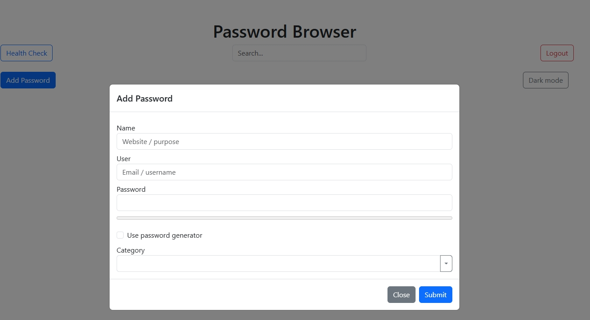
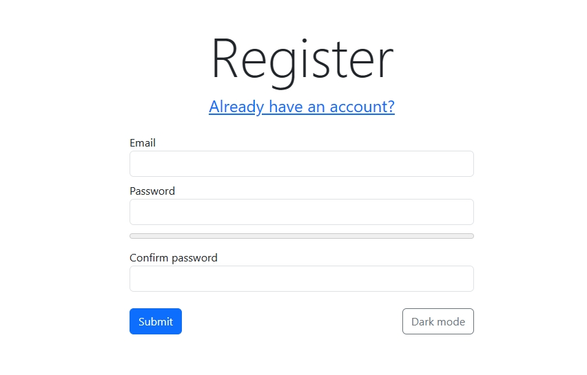
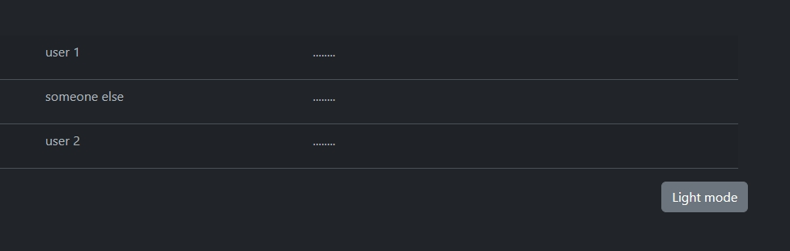
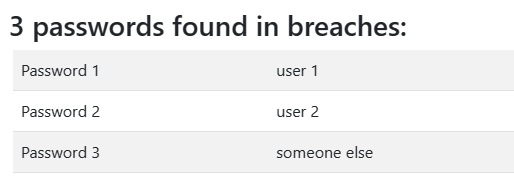
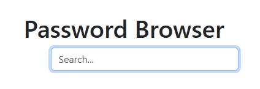

# A Level OCR CompSci Project 2023

I chose to make an online password manager for my NEA project, since it would allow me to demonstrate relatively complex code with easy "market research" and stakeholder feedback.

To make sure I targeted OCR's preferred languages, I chose to write the core algorithms in C, and compile them to WASM using [Emscripten](https://emscripten.org/).
I then developed a JavaScript interface to deal with passing data to and from these functions, with most of the code running the front-end of the site being in JavaScript.

The site follows my usual style of making web applications, which is to have essentially a static file server for HTML+JS and an API for any server businesses. No fancy templating here.

## How to run it

I would not recommend attempting to building it, since it's quite an involved process. I must also **strongly discourage** running this code in any production environment, as it has not been expertly tested for security flaws.

Looking at my shell history, I believe the process went something like this:

- Cloned [libtomcrypt](https://github.com/libtom/libtomcrypt) and [libtommath](https://github.com/libtom/libtommath) libraries
- Copied their /src/headers files into lib/ folder of my project
- Used `emmake` to build libtomcrypt and libtommath, and needed to use a lot of custom flags
- Finally prepared these two .a files in lib/, one for LTC and one for LTM
- They get linked upon compiling the project with ./build
- Ran admin.py and chose reset to initialise the database
- Change line 8 of api.py to add some random hex bytes for the key
- Make sure requirements of python flask and sqlite3 are met
- Then run api.py

## Pictures

The main home screen, with a modal to add a new password

The registration page where a user may create an account

Dark mode is available

The system can scan your passwords for ones that may be compromised in a breach

Passwords can be quickly searched

